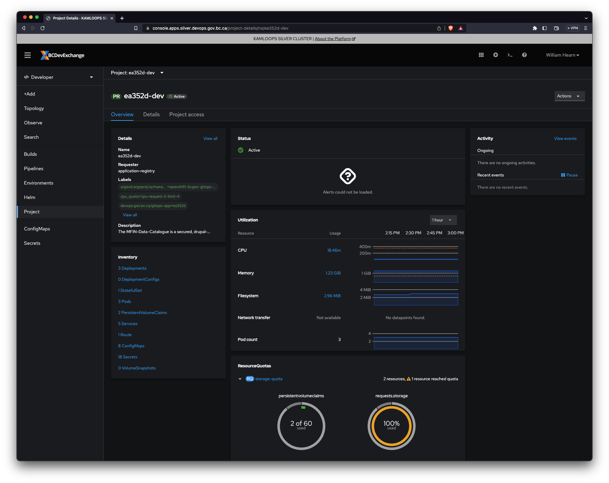
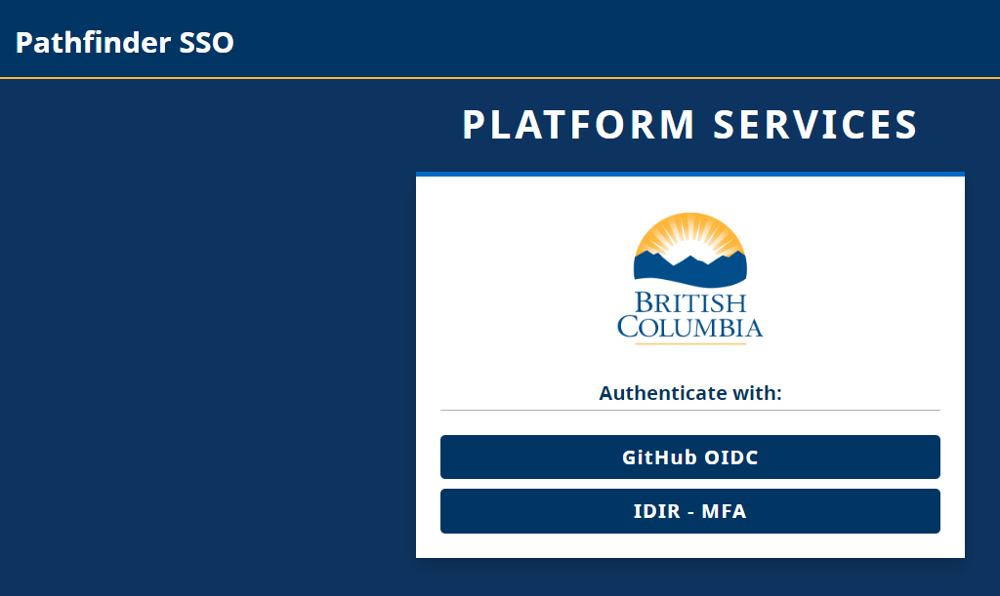

# BCGOV Platform

This documentation package illustrates the steps taken to host a Drupal app on the BC Gov Openshift environment. The sample application referred to throughout this documentation is the [Finance Data Catalogue](https://www.github.com/bcgov/MFIN-Data_Catalogue) which is built using the BC Base Build (bcbb). See [bcbb-related repositories](https://github.com/bcgov/?q=bcbb). The Openshift Silver cluster host namespace is `ea352d` for the Finance Data Catalogue.



## Login to Silver Cluster

To access the OpenShift web console please proceed to:

* https://console.apps.silver.devops.gov.bc.ca/dashboards

You may be greeted by the **OpenShift 4 Platform OAuth - Login to Silver Cluster** screen; from there click "Developer Log In" which takes you to the **Pathfinder Single Sign-On** (SSO) screen.



Select "IDIR - MFA" and authenticate using your first.last@gov.bc.ca email address with Microsoft Authenticator.

You can now use the openshift web console to perform many administrative tasks.

Should you prefer to use the command line you can either install the `oc` or the `kubectl` cli.

## Setting up local context with oc cli

Once logged in, click on your profile name and select "Copy login command" to retrieve your login credentials.

Use the following command in your terminal to log into OpenShift:

```sh
oc login --token=<token> --server=https://api.silver.devops.gov.bc.ca:6443
```

> The `oc` command is the OpenShift CLI (Command Line Interface) tool that allows you to interact with your OpenShift cluster. It provides a variety of commands for managing your projects, applications, and resources within OpenShift. Using the oc command, you can perform tasks such as creating new projects, deploying applications, managing pods, and scaling services.

## Setting up local context with kubectl

To use kubectl with OpenShift, you can simply log in using the same login command:

```sh
kubectl login --token=<token> --server=https://api.silver.devops.gov.bc.ca:6443
```

> In addition to the `oc` command, you can also use kubectl, the Kubernetes CLI tool, to interact with your OpenShift cluster. kubectl provides many of the same functionalities as oc and is useful if you are familiar with Kubernetes commands. Most kubectl commands will work in OpenShift, allowing you to manage resources, deploy applications, and perform other administrative tasks.
