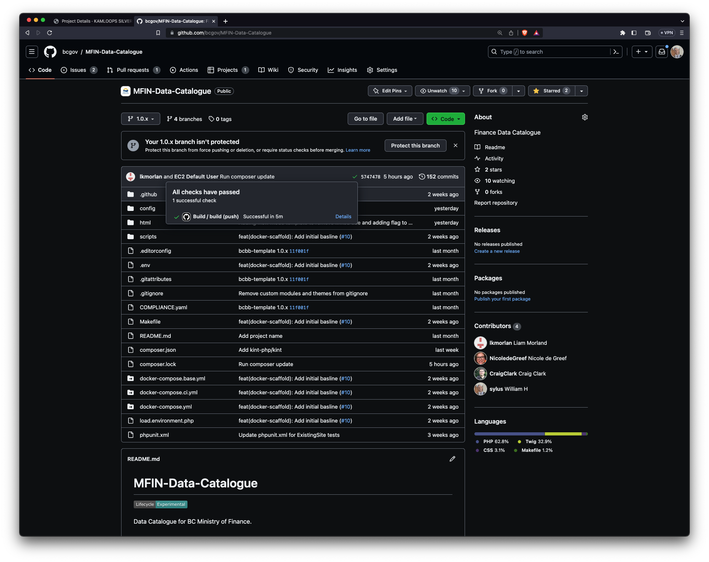
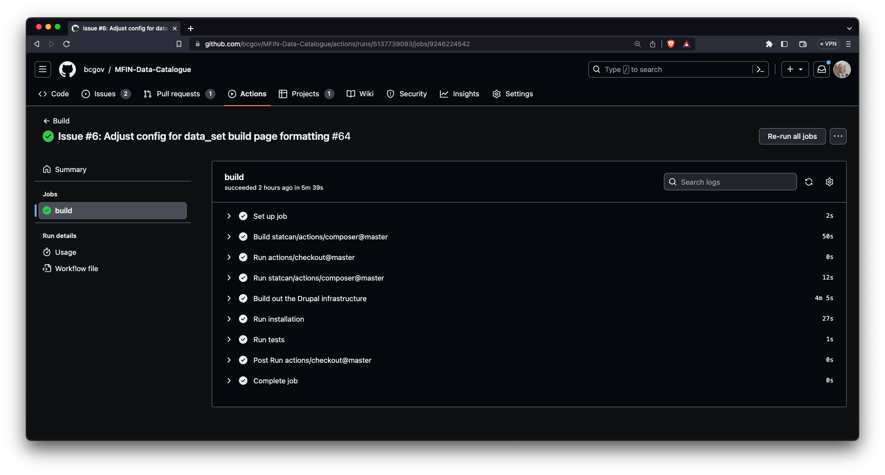

# Composer Project

The following repository has been set up based on the [Composer for Drupal Project](https://github.com/drupal-composer/drupal-project) standards:

* https://github.com/bcgov/MFIN-Data-Catalogue

## Continuous Integration

[Docker Scaffold](https://github.com/drupalwxt/docker-scaffold) has been integrated into the Composer project to facilitate continuous integration.

* https://github.com/bcgov/MFIN-Data-Catalogue/actions

> **Note**: Currently only a basic site installation is performed (see next steps).

## Next Steps

* Use a minified database rather than the site installation method for improved testing and compliance.
