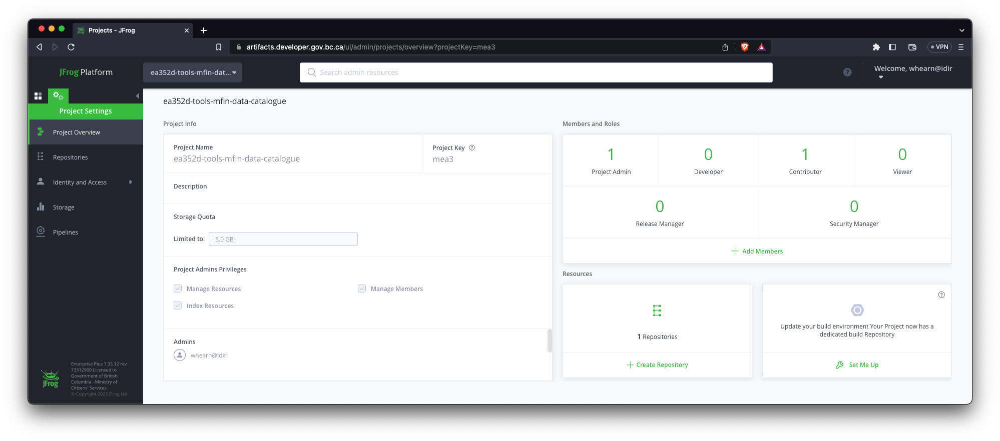
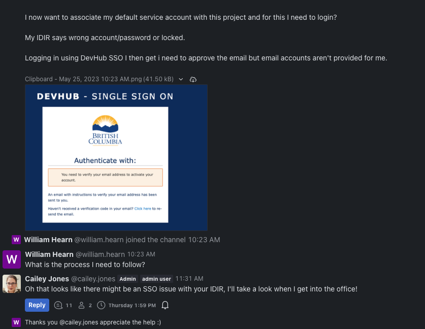
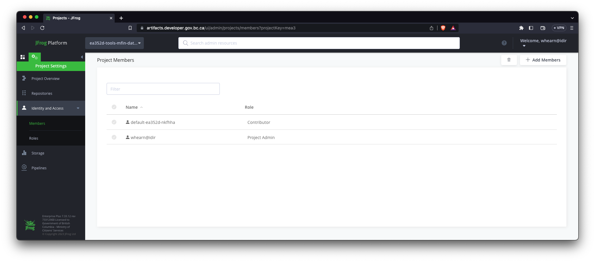

# Artifactory



## Create the Artifactory project

Recommended to consult the [BC Government Private Cloud Technical Documentation
Component](https://developer.gov.bc.ca/docs/default/component/platform-developer-docs/docs/build-deploy-and-maintain-apps/setup-artifactory-project-repository/
)


Issue the following commands to create an Artifactory project for `ea352d`:

```sh
oc project ea352d-tools
oc process -f https://raw.githubusercontent.com/bcgov/platform-services-archeobot/master/archeobot/config/samples/tmpl-artifactoryproject.yaml -p NAME="mfin-data-catalogue" | oc create -f -
oc patch artproj mfin-data-catalogue -p '{"spec":{"quota":"100"}}' --type merge
oc patch artproj mfin-data-catalogue -p '{"spec":{"quota_in_Gi":"100"}}' --type merge
```

Query the Artifactory project CRD and check the status:

```sh
oc describe artproj
```

Consult the status of the Artifactory Project:

```yaml
Name:         mfin-data-catalogue
Namespace:    ea352d-tools
Labels:       <none>
Annotations:  <none>
API Version:  artifactory.devops.gov.bc.ca/v1alpha1
Kind:         ArtifactoryProject
Metadata:
  Creation Timestamp:  2023-05-24T18:32:27Z
  Finalizers:
    finalrepo.artifactory.devops.gov.bc.ca
Spec:
  approval_status:  nothing-to-approve
  Key:              mea3
  Quota:            100
  quota_in_Gi:      100
Status:
  Conditions:
    Ansible Result:
      Changed:             0
      Completion:          2023-05-24T18:36:25.139316
      Failures:            0
      Ok:                  9
      Skipped:             3
    Last Transition Time:  2023-05-24T18:32:27Z
    Message:               Awaiting next reconciliation
    Reason:                Successful
    Status:                True
    Type:                  Running
Events:                    <none>
```

> **Note**: It's important that this CRD resource gets created in the tools namespace.

## RocketChat

There were some minor permission issues when first using Artifactory. The Platform Services Team was able to assist with this quickly.



## Added Users and Service Accounts to Project

Consulted the official [BC Government Private Cloud Technical Documentation
Component](https://developer.gov.bc.ca/docs/default/component/platform-developer-docs/docs/build-deploy-and-maintain-apps/setup-artifactory-project-repository/#add-users-and-service-accounts-to-a-project)

Added the `default-ea352d-nkfhha` service account from the `artifacts-default-fcsnzt` basic auth secret.



## Add a docker repository to project

Consulted the [BC Government Private Cloud Technical Documentation
Component](https://developer.gov.bc.ca/docs/default/component/platform-developer-docs/docs/build-deploy-and-maintain-apps/setup-artifactory-project-repository/#add-a-repository-to-your-project)

Added the docker repository `mea3-mfin-docker-local` following the given naming standards.


## Next Steps

* Wait for the containers to be pushed from Composer Project repo
* Once containers are pushed check and inspect XRay that no known critical vulnerabilities
* Any additional integration with GitHub Actions and CI
