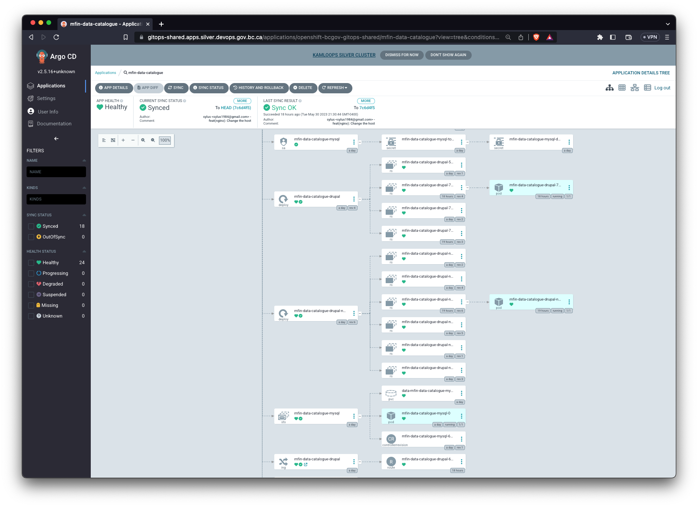
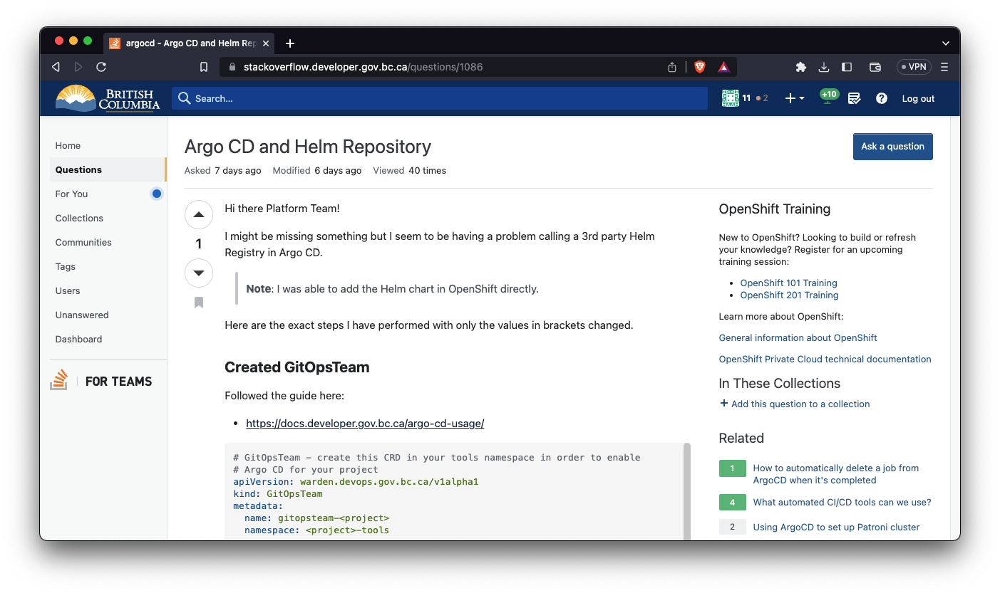
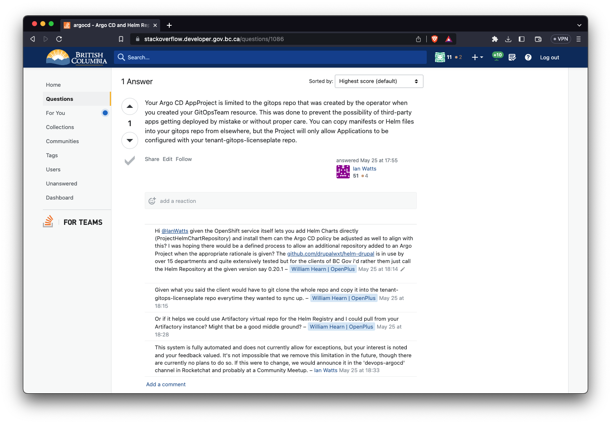
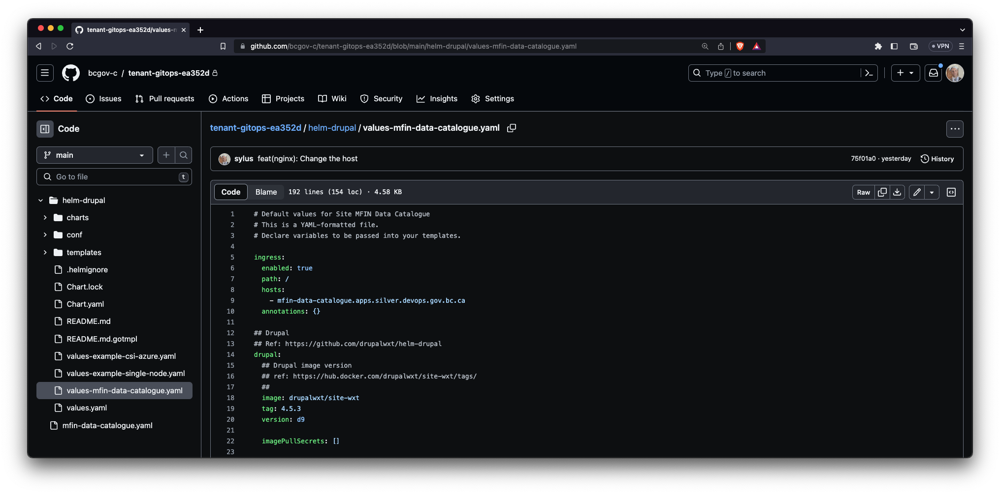
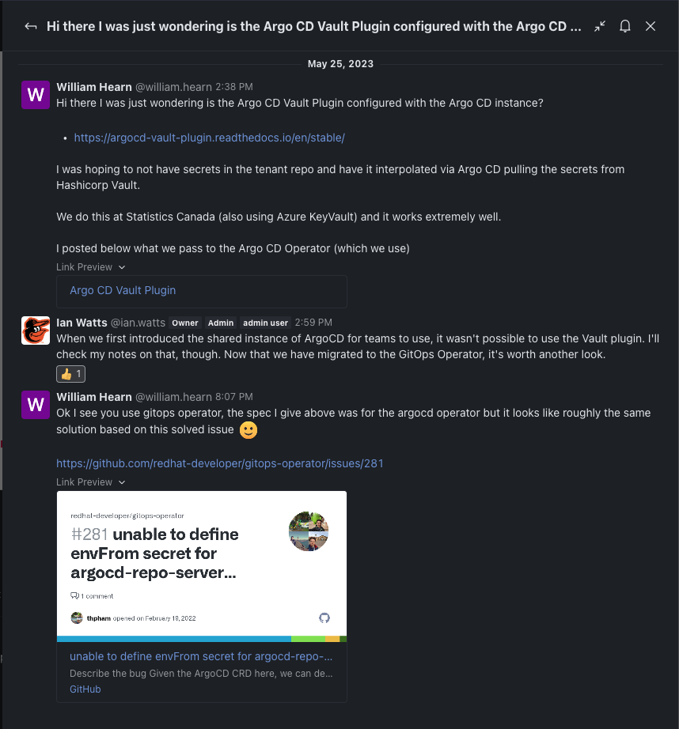
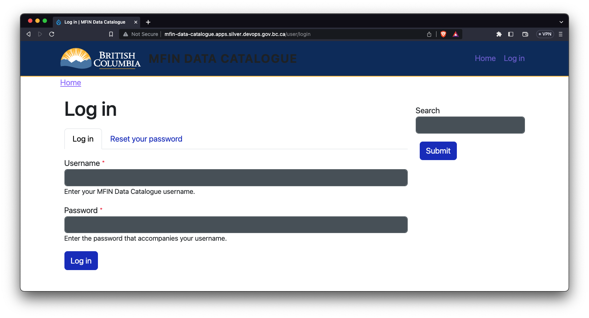
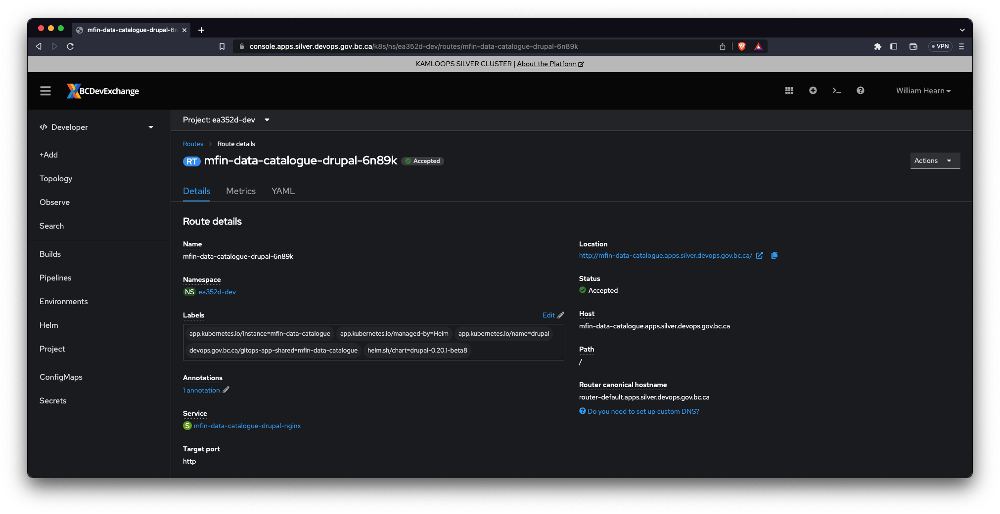
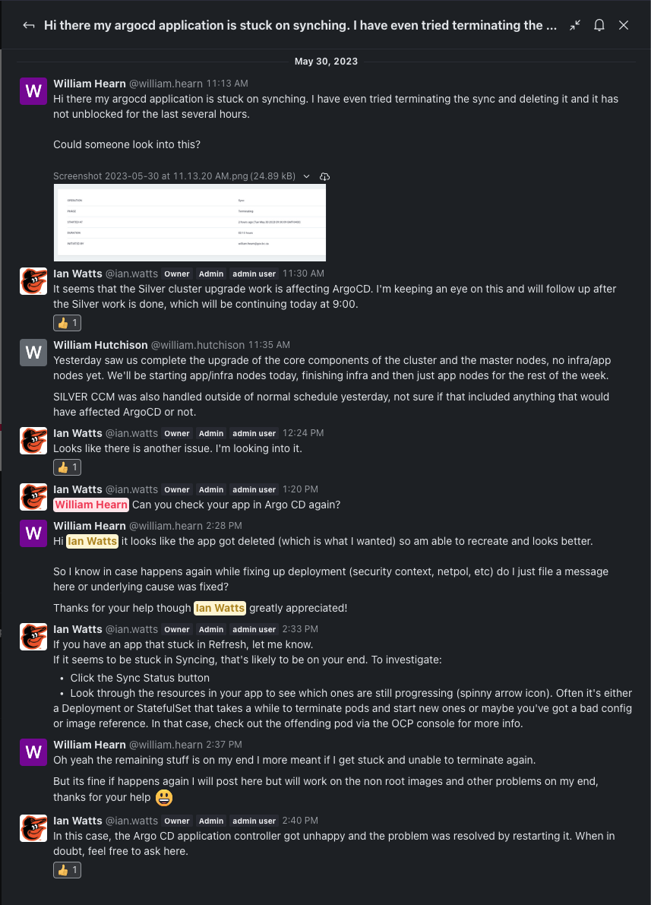

# GitOps



## Create an Argo Project

Consulted the official Platform Documentation:

* https://docs.developer.gov.bc.ca/argo-cd-usage/

Submitted the following manifest to create an Argo CD project:

```yaml
# GitOpsTeam - create this CRD in your tools namespace in order to enable
# Argo CD for your project
apiVersion: warden.devops.gov.bc.ca/v1alpha1
kind: GitOpsTeam
metadata:
  name: gitopsteam-ea352d
  namespace: ea352d-tools
spec:
  # gitOpsMembers defines the git repo access (tenant-gitops-XYZ)
  # Note that users with repo access will have to accept an invitation from
  # GitHub to join the bcgov-c GitHub organization if they are not already
  # members.
  #
  # Warning: GitHub IDs are CASE SENSITIVE
  #
  # -----------------------------------------------------------------------
  gitOpsMembers:

    # Full admin access to the repo, including repo deletion, adding of users
    # Recommended for people who need full access to the project, including
    # sensitive and destructive actions like managing security or deleting a
    # repository.
    admins:
      - sylus

    # Recommended for contributors who actively push to your project.
    writers:

    # Recommended for project managers who need to manage the repository without
    # access to sensitive or destructive actions.
    maintainers:

    # Recommended for non-code contributors who want to view or discuss your
    # project.
    readers:

    # Recommended for contributors who need to manage issues and pull requests
    # without write access.
    triage:

  # projectMembers defines access to the Argo CD UI
  # -----------------------------------------------
  projectMembers:

    # Project Maintainers have full access to the Argo CD Project, including the
    # ability create, edit, and delete Applications within the Project
    maintainers:
      - william.hearn@gov.bc.ca

    # Project Readers have read-only access to the Project in the Argo CD UI
    readers:
```

> **Note**: It's important that this CRD resource gets created in the tools namespace.

## Background around Warden Operator

The warden operator will create both an Argo Project and a git repo under the [bcgov-c](https://github.com/bcgov-c) GitHub organization to store our application manifests.

* [Argo Project](https://gitops-shared.apps.silver.devops.gov.bc.ca/applications/openshift-bcgov-gitops-shared/mfin-data-catalogue)
* [Git Tenant Repo](https://github.com/bcgov-c/tenant-gitops-ea352d/)

> **Note**: We will be using [Helm](https://helm.sh/) for our application manifests.

## Argo CD Application Manifest

There were some minor deviations of the Golden Path that I am outlining below.

Basically what I wanted to do is just have a single application manifest in the [Git Tenant Repo](https://github.com/bcgov-c/tenant-gitops-ea352d/).

The ideal application manifest would be the following:

```yaml
apiVersion: argoproj.io/v1alpha1
kind: Application
metadata:
  name: mfin-data-catalogue
  finalizers:
    - resources-finalizer.argocd.argoproj.io
  labels:
    name: mfin-data-catalogue
spec:
  project: ea352d
  destination:
    server: https://kubernetes.default.svc
    namespace: ea352d-dev
  source:
    chart: drupal
    repoURL: https://drupalwxt.github.io/helm-drupal
    targetRevision: 0.20.1-beta8
    helm:
      releaseName: mfin-data-catalogue
      values: |
        # Contents of https://github.com/bcgov-c/tenant-gitops-ea352d/blob/main/helm-drupal/values-mfin-data-catalogue.yaml would be placed inline here
  syncPolicy:
    automated:
      prune: true
      selfHeal: true
```

Instead due to constraints the application manifest is currently:

```yaml
apiVersion: argoproj.io/v1alpha1
kind: Application
metadata:
  name: mfin-data-catalogue
  finalizers:
    - resources-finalizer.argocd.argoproj.io
  labels:
    name: mfin-data-catalogue
spec:
  project: ea352d
  destination:
    server: https://kubernetes.default.svc
    namespace: ea352d-dev
  source:
    repoURL: git@github.com:bcgov-c/tenant-gitops-ea352d.git
    targetRevision: HEAD
    path: helm-drupal
    helm:
      releaseName: mfin-data-catalogue
      valueFiles:
      - values-mfin-data-catalogue.yaml
  syncPolicy:
    automated:
      prune: true
      selfHeal: true
```

### Comparison of Methods

While the two application manifests look very similar they have widely different implications.

Several reasons the first example is the `Golden Path` are:

* It simply calls the [Helm Chart for Drupal](https://github.com/drupalwxt/helm-drupal)  at its published location and you don't need to own this manifests
* You can simply call a specific packaged version of the [Helm Chart for Drupal](https://github.com/drupalwxt/helm-drupal)
* Then you just paste the overridden `values.yaml` inline directly into the `kind: Application` spec keeping things very simple

Whereas in the second example the following caveats come into play:

* The entire git repo of the [Helm Chart for Drupal](https://github.com/drupalwxt/helm-drupal) had to be copied into the [Git Tenant Repo](https://github.com/bcgov-c/tenant-gitops-ea352d/)
* In order to sync up with any upstream changes there will be manual effort rather then bumping the specificed packaged version
* All of the overridden values need to be put in a specific `values-mfin-data-catalogue.yaml` file

### Stack Overflow

An issue was created in the BC Gov Stack Overflow about Argo CD and Helm Registries with the following comments.

* https://stackoverflow.developer.gov.bc.ca/questions/1086





### Additional Note

Ideally the application manifest itself should be stored in the [Git Tenant Repo](https://github.com/bcgov-c/tenant-gitops-ea352d/).

However the current Argo Project isn't setup to automatically watch / sync the repository so the application manifest had to be directly created in the Argo CD GUI.

If we were given access to add a repository to watch this application manifest could be stored in the [Git Tenant Repo](https://github.com/bcgov-c/tenant-gitops-ea352d/) as well as the Helm Chart.



## Argo CD Vault Plugin

At the moment some secrets are stored directly in the application manifests in the [Git Tenant Repo](https://github.com/bcgov-c/tenant-gitops-ea352d/).

While this repo is private it is best practice to still not have the secrets handled in Git itself and instead Hashicorp Vault should be used and the secrets injected at runtime.

Argo CD supports this through the use of the [Argo CD Vault Plugin](https://argocd-vault-plugin.readthedocs.io/en/stable/).

### RocketChat

An conversation with a member of the platform team was had and they will be looking into adding this functionality.



## Deployment

Despite all of the caveats above a baseline proof of concept of launcing a Drupal site using Argo CD was successful.

To minimize complexity of pulling from Artifactory etc and to just confirm everything was working correctly such as shared file mounts the `site-wxt` containers were used since they are already public.

The following site was installed and confirmed to be working.



The route got automatically created from the Ingress provided by the Helm Chart.



## Troubleshooting

There was a minor issue with Argo CD where it was stuck terminating.

### RocketChat

An conversation with a member of the platform team was had and they resolved this issue.



## Next Steps

* Ensure rest of Project Team has necessary permissions
* Check for availability of Argo CD Vault Plugin after several weeks
