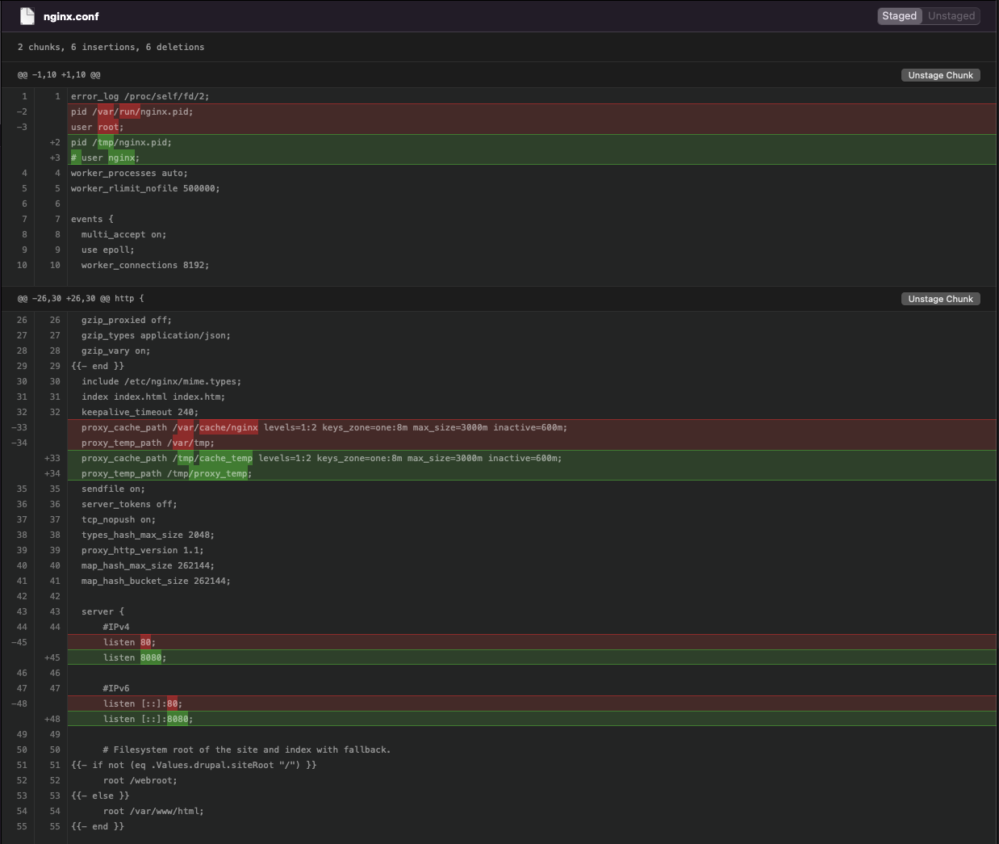

# Helm Chart

Other then the fact that the whole [Helm Chart for Drupal](https://github.com/drupalwxt/helm-drupal) had to be cloned into the [Git Tenant Repo](https://github.com/bcgov-c/tenant-gitops-ea352d/), only minimal adjustments needed to be made for the successful deployment of a Drupal Site.

## Network Policies

The following network policies needed to be added.

Allow from OpenShift ingress

```yaml
apiVersion: networking.k8s.io/v1
kind: NetworkPolicy
metadata:
  name: {{ include "drupal.fullname" . }}-allow-openshift-ingress
  labels:
    app.kubernetes.io/name: {{ include "drupal.name" . }}
    helm.sh/chart: {{ include "drupal.chart" . }}
    app.kubernetes.io/instance: {{ .Release.Name }}
    app.kubernetes.io/managed-by: {{ .Release.Service }}
spec:
  ingress:
  - from:
    - namespaceSelector:
        matchLabels:
          network.openshift.io/policy-group: ingress
  podSelector: {}
  policyTypes:
  - Ingress
```

Allow connectivity from same namespace

```yaml
kind: NetworkPolicy
apiVersion: networking.k8s.io/v1
metadata:
  name: {{ include "drupal.fullname" . }}-allow-same-ns
  labels:
    app.kubernetes.io/name: {{ include "drupal.name" . }}
    helm.sh/chart: {{ include "drupal.chart" . }}
    app.kubernetes.io/instance: {{ .Release.Name }}
    app.kubernetes.io/managed-by: {{ .Release.Service }}
spec:
  podSelector: {}
  ingress:
  - from:
    - podSelector: {}
```

> **Note**: These currently are more permissive then they need to be and will be refined.

## Security Contexts

The default [Helm Chart for Drupal](https://github.com/drupalwxt/helm-drupal) sets Security Contexts and this conflicts with OpenShift which dynamically sets these.

Simply setting `securityContext` to an empty object resolves these errors.

Noticably the MySQL spec required the following:

```yaml
  primary:
    persistence:
      storageClass: netapp-file-standard
      annotations: {}
      accessMode: ReadWriteMany
      size: 8Gi
    podSecurityContext:
      enabled: false
    containerSecurityContext:
      enabled: false
```

## Nginx

Mentioned in the containers section Nginx needed a few adjustments from the Helm Chart level in order to successfully deploy.

* Port 8080 instead of 80 (since 80 is a reserved port)
* The nginx.conf configmap needed to be slightly edited
* Needed to call the unprvileged container of Nginx in order to successfully startup.

The adjustments that needed to be made to the nginx.conf are encapsulated in the below screen shot:


